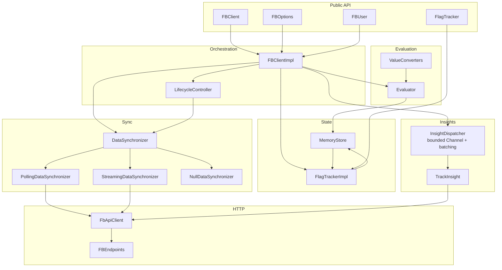

# Architecture Walkthrough

A reverse-engineered map of the FeatBit Android SDK, intended as an on-ramp for
new contributors. Read [`usage.md`](../usage.md) first if you only want to *use*
the SDK; this document is for people changing it.

The SDK is split into two Gradle modules:

| Module                   | Purpose                                                                   |
|--------------------------|---------------------------------------------------------------------------|
| `featbit-client`         | Pure Kotlin/JVM core — store, evaluator, sync, insights, public API.      |
| `featbit-client-android` | Android-only adapter that wires `ProcessLifecycleOwner` + `ConnectivityManager` into the core's `setForeground` / `setNetworkAvailable` hooks. |

## Component map

```text
┌─────────────────────── Public API (consumer surface) ───────────────────────┐
│  FBClient (interface)  ──  FBOptions / FBOptions.Builder  ──  FBUser        │
│  FlagTracker  ──  EvalDetail<T>  ──  FBLogger                               │
└─────────────────────────────────────────────────────────────────────────────┘
                                    │
                                    ▼
┌──────────────────────── Orchestration (FBClientImpl) ───────────────────────┐
│  Wires: store + evaluator + tracker + insights + synchronizer + lifecycle.  │
│  Holds AtomicReference<FBUser> + AtomicReference<DataSynchronizer>.         │
│  identify() swaps the synchronizer under identifyMutex.                     │
└─────────────────────────────────────────────────────────────────────────────┘
        │                  │                  │                  │
        ▼                  ▼                  ▼                  ▼
 Evaluation path    Sync path           Insight path       Lifecycle path
  Evaluator  ──▶   DataSynchronizer     InsightDispatcher   LifecycleController
       │            ├ NullSync             │   (bounded      (Mutex + grace
       ▼            ├ PollingSync          ▼    Channel,      debounce)
  MemoryStore       └ StreamingSync     TrackInsight         │
       │                │                 ├ Noop             │
       │                ▼                 └ Http             │
  FlagTrackerImpl   FbApiClient (OkHttp + JSON)              │
   (SharedFlow,         ▲                                    │
    keyed + global)     │                                    │
       ▲             HTTP / WS                               │
       │            (FeatBit BE)                             │
       └──── store.addChangeListener                         │
                                                             │
                                          ◀────── ProcessLifecycle / ConnectivityManager
                                                  (via FBLifecycleConnector in
                                                   :featbit-client-android)
```

The same picture, in Mermaid (renders nicely on GitHub / IntelliJ / MkDocs):



## Data flow

### 1. Boot (`FBClient.start`)

1. `FBClientImpl.<init>` constructs the `DefaultMemoryStore` (optionally pre-seeded
   from `options.bootstrap`), the `Evaluator`, the `FlagTrackerImpl` (which
   registers a single `FlagChangeListener` on the store), the `InsightDispatcher`
   (with a `Channel(capacity=256, DROP_OLDEST)`), and the initial
   `DataSynchronizer` for the initial user.
2. `start(timeout)` suspends until the synchronizer's first sync completes (or
   the timeout elapses).
3. **Polling**: spawns a `pollingLoop()` coroutine that POSTs `latest-all`,
   upserts every flag into the store, and `delay()`s for `pollingInterval`.
4. **Streaming**: opens an OkHttp WebSocket, sends a `data-sync` message, and
   processes server messages (`full` snapshot + `patch` updates) by upserting
   into the store. A 20-second app-level ping keeps the connection alive;
   exponential backoff (with jitter) handles reconnects.
5. The store fires `FlagValueChangedEvent`s only when a flag's `variation`
   actually changes — the diff is computed under a single write monitor before
   the new value is stored.

### 2. Evaluation (`boolVariation`, etc.)

1. Fast path: if the synchronizer isn't initialized and there's no bootstrap,
   return `EvalDetail("client not ready", default)`.
2. `Evaluator.evaluate(key)` does a lock-free `ConcurrentHashMap.get` on the
   store and returns a sealed `EvalResult` (`Found(flag)` or `NotFound`).
3. On `Found`, the call **enqueues** an `Insight.forEvaluation(...)` on the
   `InsightDispatcher` (non-suspending; drops the oldest pending event on
   overflow). The consumer coroutine coalesces events into batches of up to 50
   or one second, whichever is shorter, and POSTs the batch to
   `api/public/insight/track`.
4. `ValueConverters` coerces the raw `variation` string into the requested
   type; on coercion failure the API returns `EvalDetail("type mismatch", default)`.

### 3. Identify (`FBClient.identify(user)`)

`identify()` swaps the active synchronizer atomically:

1. Acquire `identifyMutex`.
2. `close()` the previous synchronizer (cancels its scope; cancels in-flight
   polls / closes the WebSocket; completes its `startTask` with `false`).
3. Build a fresh synchronizer for the new user, install it under
   `AtomicReference<DataSynchronizer>`, and update the user under
   `AtomicReference<FBUser>`.
4. `await` the new synchronizer's first sync, then enqueue
   `Insight.forIdentify(user)`.

The mutex + ordering ensures that a late upsert from the previous
synchronizer cannot reach the store after the new one has started — the
previous synchronizer's coroutine scope has already been cancelled.

### 4. Lifecycle (background / network)

`LifecycleController` keeps a small state machine guarded by a `Mutex`:

* `foreground && online` → synchronizer is *active*; cancel any pending pause.
* otherwise → schedule `dataSynchronizer.pause()` after `backgroundGracePeriod`
  (default 20s) to absorb brief app-switches and network blips.

`FBLifecycleConnector` in `:featbit-client-android` wires the controller to
`ProcessLifecycleOwner` and `ConnectivityManager.NetworkCallback`.

## Concurrency model (one paragraph)

The hot read path is lock-free: `MemoryStore.get` is a `ConcurrentHashMap.get`
and the current user / synchronizer are held in `AtomicReference`s. Writes go
through a single monitor in `DefaultMemoryStore.upsert` so the "diff against
old value → store" sequence is atomic; listeners are notified *outside* the
lock to avoid reentrancy. `identify()` is the only public mutator that needs
mutual exclusion and uses `identifyMutex`. All background work runs on a
`SupervisorJob() + Dispatchers.IO` scope owned by `FBClientImpl` and torn down
in `close()`. The insight pipeline is a single `Channel`-backed consumer
coroutine — no per-evaluation `launch`.

## Module / package layout

```
featbit-client/
└── src/main/kotlin/co/featbit/client/
    ├── FBClient.kt                  public API surface
    ├── FBClientImpl.kt              orchestration (this is the wiring hub)
    ├── FBLogger.kt / DefaultLogger.kt
    ├── LifecycleController.kt       foreground/online state machine
    ├── changetracker/
    │   ├── FlagTracker.kt           public subscription API
    │   └── FlagTrackerImpl.kt       fans events to subscribers + SharedFlow
    ├── datasynchronizer/
    │   ├── DataSynchronizer.kt      interface (start/pause/resume/close)
    │   ├── NullDataSynchronizer.kt  offline / no-op
    │   ├── PollingDataSynchronizer.kt
    │   └── StreamingDataSynchronizer.kt
    ├── evaluation/
    │   ├── EvalDetail.kt            public result with reason
    │   ├── EvalResult.kt            internal sealed result (Found | NotFound)
    │   ├── Evaluator.kt
    │   └── ValueConverters.kt       string → bool/int/float/double/string
    ├── internal/
    │   ├── FbApiClient.kt           OkHttp base (auth, JSON, POST)
    │   ├── FBEndpoints.kt           one source of truth for URLs
    │   ├── HttpConstants.kt
    │   ├── ConnectionToken.kt       streaming auth encoder
    │   ├── GetUserFlags.kt          polling endpoint client
    │   ├── TrackInsight.kt          insight endpoint client
    │   └── InsightDispatcher.kt     bounded queue + batch flush
    ├── model/
    │   ├── FBUser.kt                public builder
    │   ├── EndUser.kt               wire format
    │   ├── FeatureFlag.kt
    │   └── Insight.kt               analytics payloads
    ├── options/
    │   ├── DataSyncMode.kt
    │   └── FBOptions.kt
    └── store/
        ├── FlagValueChangedEvent.kt
        ├── MemoryStore.kt           public interface
        └── DefaultMemoryStore.kt
```

## Pointers for common changes

| Change                                       | Start here                                              |
|----------------------------------------------|---------------------------------------------------------|
| Add an HTTP endpoint                         | `internal/FBEndpoints.kt` + `internal/HttpConstants.kt` |
| Add a new sync strategy                      | implement `DataSynchronizer`, register in `FBClientImpl.newDataSynchronizer` |
| Add a new variation type                     | `evaluation/ValueConverters.kt` + matching method on `FBClient` |
| Tune insight batching / backpressure         | `internal/InsightDispatcher.kt` constructor defaults    |
| Tune lifecycle debounce                      | `FBOptions.Builder.backgroundGracePeriod`               |
| Change wire format for evaluation payload    | `model/EndUser.kt` + `model/FBUser.kt`                  |
